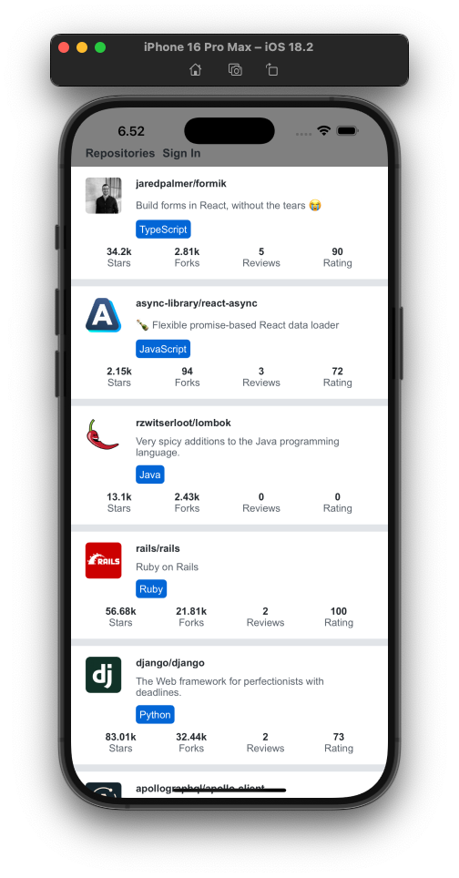

# Repository Rating App Frontend


This project is an ongoing development of a simple frontend for a repository rating application. It allows users to view and rate repositories and is built using **React Native** with **Expo** for a seamless cross-platform experience.

## Features

- **View Repositories:** Browse and search a curated list of repositories.
- **Rate Repositories:** Submit ratings and feedback for each repository.
- **Responsive Design:** Optimized for mobile devices using React Native components.

## Technologies Used

- **React Native**
- **Expo**
- **JavaScript**

## Getting Started

### Prerequisites

- [Node.js](https://nodejs.org/)
- [Expo CLI](https://docs.expo.dev/workflow/expo-cli/)

### Installation

Clone the repository and install dependencies:

```bash
git clone https://github.com/chenxu2394/rate-repository-app.git
cd rate-repository-app
npm install
```

### Running the App

To start the development server, run:

```bash
npm start
```



### Credits

[FullStackOpen](https://fullstackopen.com/en/)
